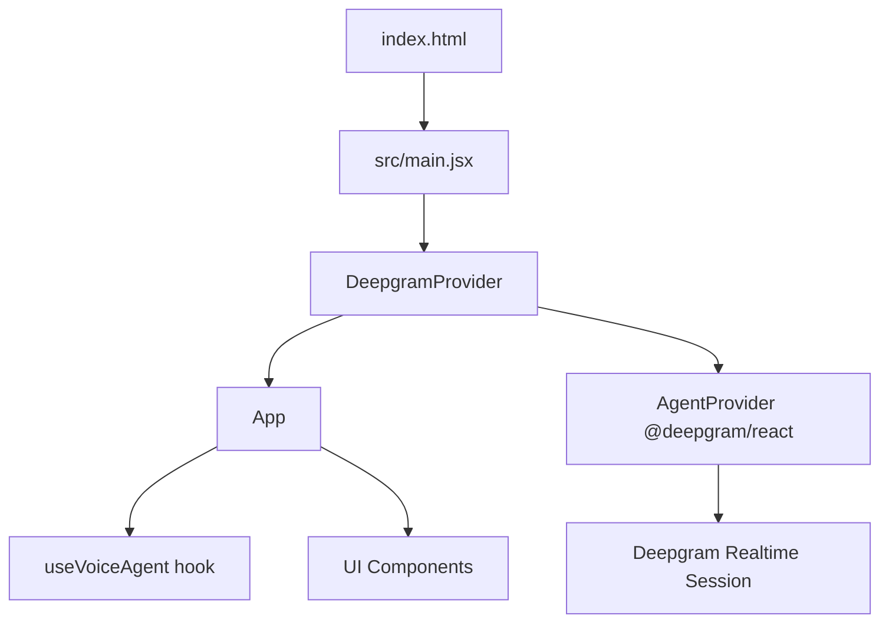

# Deepgram Voice Agent UI (React + Vite)

Frontend-only Voice AI application built with React and Vite using the Deepgram React SDK.

This project has no custom backend. The browser app connects directly to Deepgram using a Vite environment variable.

## 1) Project Flow



### Runtime sequence

1. `src/main.jsx` renders `App` wrapped by `DeepgramProvider`.
2. `DeepgramProvider` reads `VITE_DEEPGRAM_API_KEY` and builds agent runtime config.
3. `AgentProvider` from `@deepgram/react` creates the realtime session.
4. `useVoiceAgent` reads SDK state/mode/conversation and exposes UI-friendly flags.
5. Components render controls, orb status, and transcript.

## 2) Tech Stack

- React 18
- Vite 5
- JavaScript (no TypeScript source)
- `@deepgram/react`
- `@deepgram/agents`

## 3) Prerequisites

- Node.js 18+ (Node 20 recommended)
- npm
- Deepgram API key

## 4) Local Setup

### Step A: Install dependencies

```powershell
npm install
```

### Step B: Create env file

Create `.env` in project root with:

```env
VITE_DEEPGRAM_API_KEY=your_real_deepgram_api_key
```

### Step C: Start development server

```powershell
npm run dev
```

Open the local URL printed in terminal (usually `http://localhost:5173`).

## 5) Build and Preview (production-like local test)

```powershell
npm run build
npm run preview
```

## 6) Available Scripts

- `npm run dev` -> start Vite development server
- `npm run build` -> production build to `dist`
- `npm run preview` -> serve built `dist` locally

## 7) Environment Variables

Required:

- `VITE_DEEPGRAM_API_KEY`

Notes:

- This is a Vite public variable and is bundled into frontend output at build time.
- For production security, consider migrating to a short-lived token/backend pattern.

## 8) Deployment Options

## Option A: Azure App Service (Node runtime)

1. Build command: `npm run build`
2. Start command for static output can be done via process manager (example used in project history):
   - `pm2 serve /home/site/wwwroot --no-daemon --spa`
3. Ensure `VITE_DEEPGRAM_API_KEY` is available during build stage.

## Option B: Azure Container Apps with ACR

This repository includes container deployment files:

- `Dockerfile` (multi-stage Node build + Nginx runtime)
- `nginx.conf` (SPA route fallback to `index.html`)
- `.dockerignore`

Build argument supported by Dockerfile:

- `VITE_DEEPGRAM_API_KEY`

Example image build:

```powershell
docker build --build-arg VITE_DEEPGRAM_API_KEY=your_real_deepgram_api_key -t deepgram-voice-agent-ui:latest .
```

## 9) Troubleshooting

### API Key Missing screen

If UI shows API key missing:

- Check `.env` exists in project root
- Check variable name is exactly `VITE_DEEPGRAM_API_KEY`
- Restart dev server after env updates

### Slow think response warning

If console shows `SLOW_THINK_REQUEST`:

- Use a faster LLM model in UI
- Shorten system prompt complexity
- Test using `npm run build && npm run preview` for production-like performance

### Favicon 404 in dev console

- Non-blocking warning, does not affect voice session behavior

## 10) Repository Structure (important paths)

- `src/main.jsx` -> app entry point
- `src/App.jsx` -> layout and orchestration
- `src/providers/DeepgramProvider.jsx` -> env key + SDK provider wrapper
- `src/hooks/useVoiceAgent.js` -> SDK hook aggregation and derived flags
- `src/config/agentConfig.js` -> prompt + provider/model config
- `src/components/*` -> UI components
- `src/styles/app.css` -> styling

## 11) Security Reminder

Do not commit real API keys. Keep `.env` private and rotate exposed keys immediately.
